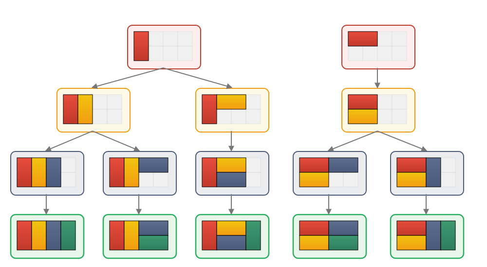

# Solving Pips with F#

```
        ┌───────┐
        │     = │
    ┌───┴───┬───┴───┬───┬───┬───┐
    │     6 │    12 │ 5 │   │   │
    ├───┬───┼───┬───┴───┤   │   ├───┐
    │   │   │ * │     ≠ │   │10 │ * │
┌───┘   │   ├───┼───────┤   ├───┴───┤
│    18 │   │ * │    10 │ 6 │       │
└───────┘   ├───┴───┬───┴───┤       │
            │       │       │     0 │
            │       │       ├───┬───┤
            │     4 │       │<3 │<2 │
            └───────┘       └───┴───┘

Dominoes:

0-1   0-2   1-1   1-2   1-5   2-4   3-0
3-4   3-6   4-0   4-5   5-2   6-2   6-4
6-5   6-6

Found a solution in 00:00:01.0045242:

        ┌───┬───┐
        │ 4 │ 4 │
    ┌───┤   │   ├───────┬───────┐
    │ 3 │ 3 │ 6 │ 6   5 │ 2   6 │
    │   ├───┼───┴───┬───┴───┬───┼───┐
    │ 6 │   │ 4   5 │ 4   2 │ 4 │ 3 │
┌───┴───┤   ├───┬───┼───────┤   │   │
│ 6   6 │   │ 2 │ 5 │ 5   2 │ 0 │ 0 │
└───────┘   │   │   ├───────┼───┼───┤
            │ 1 │ 1 │       │ 0 │ 0 │
            ├───┴───┤       │   │   │
            │ 1   1 │       │ 2 │ 1 │
            └───────┘       └───┴───┘
```

# Introduction

[Pips](https://www.nytimes.com/games/pips) is a new puzzle game from the New York Times. The object is to cover a shape made from square cells with a set of dominoes, subject to some constraints, such as that the number of pips in a region of the puzzle must sum to a specific number. The Times publishes three puzzles every day, labeled "easy", "medium", and "hard". (In fact, as of this writing, they publish the puzzle data well ahead of time, if you're willing to read [JSON](https://www.nytimes.com/svc/pips/v1/2025-11-13.json).)

Solving Pips is a good programming challenge because the number of possible solutions increases quickly as the board gets larger. Some of the hard-level Pips games can take a very long time to solve by a brute force search, so we'll have to be clever to get the time under, say, a few seconds in the worst case.

# Backtracking

To solve Pips, we'll use a [backtracking](https://en.wikipedia.org/wiki/Backtracking) algorithm, which is essentially a rigorous version of "trial and error". The idea is to place one domino at a time on the board. If, after placing a domino, the resulting state of the puzzle is still valid (i.e. conforms to all the constraints), then we repeat the procedure with another domino in another location, etc. If the placement is invalid, we pick up that domino and try another one in that spot. In this way, we will eventually find all solutions to the puzzle, or we can stop after we find the first one. Most of the hard Pips puzzles have a single solution, but a few have more than 100 distinct solutions, and one has [2,764,800](https://www.forbes.com/sites/erikkain/2025/09/14/todays-nyt-pips-hints-and-solutions-for-monday-september-15th/)!

We'll use [F#](https://fsharp.org/) to implement this algorithm because functional programming is a good choice for "black box" problems like this that have no side-effects, and [.NET](https://dotnet.microsoft.com/) is an easy, fast platform to work with. (F# is actually a great all-purpose language for just about anything, but I digress.)

In order to speed up the search for solutions, we'll make two improvements over vanilla backtracking:

* Use geometric information about possible tilings to guide the search.
* Prune the search tree aggressively to avoid investigating dead ends.

More on both of these enhancements below.

# Tiling

One key observation is that there are only so many ways to tile a given shape with dominoes. For example, there are just three ways to tile a 2×3 rectangle:

```
┌───┬───┬───┐      ┌───┬───────┐      ┌───────┬───┐
│ ■ │ ■ │ ■ │      │ ■ │ ■   ■ │      │ ■   ■ │ ■ │
│   │   │   │      │   ├───────┤      ├───────┤   │
│ ■ │ ■ │ ■ │      │ ■ │ ■   ■ │      │ ■   ■ │ ■ │
└───┴───┴───┘      └───┴───────┘      └───────┴───┘
```

So a tiling that starts off like this:

```
┌───┬───────┐
│   │ ■   ■ │
├───┴───┬───┤
│ ■   ■ │   │
└───────┴───┘
```
 is bound to fail because we've left two unconnected 1x1 areas, and there's no way to tile an odd number of cells with dominoes.

 We can use this knowledge to reduce the number of configurations we have to examine when searching for Pips solutions. For example, if we start by placing a domino horizontally in the top-left corner of the 2×3 rectangle, we know where the other two dominoes have to go:

 ```
 ┌───────┬───┐     ┌───────┬───┐
 │ ■   ■ │   │     │ ■   ■ │ ■ │
 ├───────┘   │  →  ├───────┤   │ 
 │           │     │ ■   ■ │ ■ │
 └───────────┘     └───────┴───┘
 ```

 To guide our backtracking algorithm, we can organize the tilings of a given shape into a "forest" of trees. Each node in a tree shows the placement of a domino in the tiling, and its child nodes show how the rest of the dominoes are placed, until we get each of the complete tilings as leaf nodes. For example, here are the five distinct tilings of a 2x4 rectangle arranged step-by-step in trees:

 

 (Side note: Gemini is quite good at generating SVG images, if you coax it along. But PNGs, not so much.)

 With this in mind, our backtracking algorithm is:

 * Given: A Pips puzzle in some state of completion, and a collection of tiling trees that indicate where the next domino might be placed.
 * If there are no more dominoes to place, the puzzle is solved.
 * Otherwise, for each given tiling tree:
   * Get the next domino location from the root of the tree.
   * Try placing each remaining domino in that location. If that is a valid placement, recursively apply the algorithm to the child trees. (Don't forget to try placing the domino in both orientations, if it is not a double.)

# Pruning

If we wait until all dominoes have been placed to check whether the constraints of the puzzle have been met, it can take too long to find a solution. Instead, we aggressively check the constraints as we go along, and backtrack as soon as we know that a solution isn't possible along the current path. This process is called "pruning" the search tree.

Note that placing a domino in one region of the puzzle can affect the validity of another region, because dominoes can't be used twice. This means that we have to check the validity of all the regions of the puzzle after each domino is placed.

## "Equal" region

All cells in an "equal" region must have the same value, although the value itself is not specified by the constraint. We use two rules to validate these regions:

1. The number of distinct pip counts in the region cannot exceed one.

2. There must be enough matching values available among the remaining dominoes to fill the region, For example, if the region has four cells, and one of them is covered by a domino with 2 pips on that side, are there at least three more domino sides with 2 pips among the remaining dominoes?

## "Unequal" region

All cell values in an "unequal" region must be different. Again, we use two rules to validate these regions:

1. The number of distinct pip counts in the region cannot be less than the number of filled cells.

2. There must be enough distinct values available among the remaining dominoes to fill the region.

## "Sum less than" region

The sum of all cell values in this type of region must be less than the specified target. There are two ways to validate these regions:

1. The sum of all filled cells in the region must always be less than the specified target.

2. There must be enough small values available among the remaining dominoes to fill the region without exceeding the target. For example, if a values in a three-cell region must sum to less than 15, and two of the cells are already filled with 5 and 6 pips, then there must be at least one domino side with 3 or fewer pips among the unused dominoes.

## "Sum greater than" region

The sum of all cell values in this type of region must be greater than the specified target. In this case, we can't invalidate the region just because the filled cells don't yet exceed the target. However, we can still prune the search tree using this rule:

1. There must be enough large values available among the remaining dominoes to fill the region and exceed the target.

## "Sum exact" region

The sum of all cell values in this type of region must equal the specified target. This is the most complex region type to validate, because we have to consider both upper and lower bounds:

1. The sum of all cell values in the region must never exceed the target. (Assuming there are no negative pip counts!)

2. If the region is completely filled, the sum must equal the target.

3. Otherwise, there must be enough small values among the remaining dominoes to fill the region without exceeding the target, and there must also be enough large values among them to reach the target.

4. Lastly, we can use a knapsack algorithm to determine whether it is possible to reach the specified sum with the remaining dominoes. This is an expensive check, so we only perform it if the other checks pass.

# Results

As of this writing, there have been 88 hard Pips puzzles published by the New York Times, from August 18 to November 13, 2025. Using the above algorithm, I was able to find a solution to all of them in a total of about 1.8 seconds on my development machine (a Dell XPS with an Intel i9-12900 CPU). The hardest by far was the elephant-shaped puzzle from October 14 (top illustration), which took just over one second to solve.

Finding all the solutions to each puzzle took longer, especially for the monster from September 15, which took 130 seconds:

| Date       | \# solutions | Time (sec.) |
| ---------- | -----------: | ----------: |
| 2025-08-18 | 2            | 0.020516    |
| 2025-08-19 | 4            | 0.004657    |
| 2025-08-20 | 1            | 0.000388    |
| 2025-08-21 | 2            | 0.002529    |
| 2025-08-22 | 1            | 0.000714    |
| 2025-08-23 | 80           | 0.020296    |
| 2025-08-24 | 2            | 0.001438    |
| 2025-08-25 | 1            | 0.001183    |
| 2025-08-26 | 2            | 0.001423    |
| 2025-08-27 | 1            | 0.000157    |
| 2025-08-28 | 32           | 0.007514    |
| 2025-08-29 | 1            | 0.003335    |
| 2025-08-30 | 1            | 0.000615    |
| 2025-08-31 | 3            | 0.004327    |
| 2025-09-01 | 12           | 0.001288    |
| 2025-09-02 | 4            | 0.000553    |
| 2025-09-03 | 1            | 0.000794    |
| 2025-09-04 | 86           | 0.011203    |
| 2025-09-05 | 1            | 0.127658    |
| 2025-09-06 | 1            | 0.021797    |
| 2025-09-07 | 1            | 0.053257    |
| 2025-09-08 | 1            | 0.001378    |
| 2025-09-09 | 1            | 0.006709    |
| 2025-09-10 | 1            | 0.000691    |
| 2025-09-11 | 1            | 0.009167    |
| 2025-09-12 | 1            | 0.001099    |
| 2025-09-13 | 1            | 0.021063    |
| 2025-09-14 | 1            | 0.006007    |
| 2025-09-15 | 2,764,800    | 130.3538    |
| 2025-09-16 | 4            | 0.001434    |
| 2025-09-17 | 48           | 0.075455    |
| 2025-09-18 | 1            | 0.000655    |
| 2025-09-19 | 3            | 0.0009      |
| 2025-09-20 | 3            | 0.009523    |
| 2025-09-21 | 1            | 0.004005    |
| 2025-09-22 | 1            | 0.009006    |
| 2025-09-23 | 4            | 0.00091     |
| 2025-09-24 | 1            | 0.002811    |
| 2025-09-25 | 1            | 0.00264     |
| 2025-09-26 | 1            | 0.003948    |
| 2025-09-27 | 1            | 0.298655    |
| 2025-09-28 | 2            | 0.001466    |
| 2025-09-29 | 1            | 0.004621    |
| 2025-09-30 | 110          | 0.013435    |
| 2025-10-01 | 2            | 0.001635    |
| 2025-10-02 | 1            | 0.002285    |
| 2025-10-03 | 1            | 0.005445    |
| 2025-10-04 | 2            | 0.001824    |
| 2025-10-05 | 344          | 0.005926    |
| 2025-10-06 | 1            | 0.000169    |
| 2025-10-07 | 4            | 0.001755    |
| 2025-10-08 | 1            | 0.013341    |
| 2025-10-09 | 1            | 0.004663    |
| 2025-10-10 | 1            | 0.033275    |
| 2025-10-11 | 1            | 0.000261    |
| 2025-10-12 | 1            | 0.001663    |
| 2025-10-13 | 1            | 0.000392    |
| 2025-10-14 | 1            | 2.195293    |
| 2025-10-15 | 1            | 0.003404    |
| 2025-10-16 | 4            | 0.002392    |
| 2025-10-17 | 1            | 0.004691    |
| 2025-10-18 | 10,464       | 1.029367    |
| 2025-10-19 | 1            | 0.006375    |
| 2025-10-20 | 1,920        | 0.020453    |
| 2025-10-21 | 1            | 0.002274    |
| 2025-10-22 | 5            | 0.010035    |
| 2025-10-23 | 1            | 0.010968    |
| 2025-10-24 | 1            | 0.202118    |
| 2025-10-25 | 1            | 0.276247    |
| 2025-10-26 | 1            | 0.000799    |
| 2025-10-27 | 16           | 0.003998    |
| 2025-10-28 | 166,724      | 49.59692    |
| 2025-10-29 | 134          | 0.008858    |
| 2025-10-30 | 96           | 0.022475    |
| 2025-10-31 | 32           | 0.003738    |
| 2025-11-01 | 1            | 0.031238    |
| 2025-11-02 | 1            | 0.000932    |
| 2025-11-03 | 1            | 0.001732    |
| 2025-11-04 | 1            | 0.003039    |
| 2025-11-05 | 2            | 0.000727    |
| 2025-11-06 | 1            | 0.003653    |
| 2025-11-07 | 12           | 0.001552    |
| 2025-11-08 | 10           | 0.001804    |
| 2025-11-09 | 1            | 0.010293    |
| 2025-11-10 | 1            | 0.004396    |
| 2025-11-11 | 4            | 0.002176    |
| 2025-11-12 | 2            | 0.000907    |
| 2025-11-13 | 34           | 0.003914    |

# Implementation

We're finally ready to turn these ideas into code!

## Domino

True to the name of the game, the dots on a domino are called "pips", and each side of a domino has between 0 and 6 pips. For example, this is the 6-5 domino:

```
┌───────┬───────┐
│ o o o │ o   o │
│       │   o   │
│ o o o │ o   o │
└───────┴───────┘
```

The corresponding F# types:

```fsharp
/// Number of pips on one side of a domino.
type PipCount = int

/// The two sides of a domino.
type Domino =
    {
        /// Left side of the domino.
        Left : PipCount

        /// Right side of the domino.
        Right : PipCount
    }
```

The code actually makes no assumption that 6 is the largest pip count on a domino, although this is the convention in all NY Times puzzles.

A domino is a "double" if the pip count is the same on both sides:

```fsharp
module Domino =

    /// Is the given domino a "double", such as 6-6?
    let isDouble domino =
        domino.Left = domino.Right
```

Doubles are special because they only have one distinct orientation, while other dominoes have two.

Note that, according to this definition, the 6-4 domino is different from the 4-6 domino. We could implement custom equality and comparison to make them equal, but it would slow down the solver for little benefit. By convention, there are no duplicate dominoes in a Pips puzzle, so checking for them is not necessary.

## Cell

Each cell on the board has (row, column) coordinates:

```fsharp
/// A cell in a grid.
type Cell =
    {
        /// Row coordinate (0-based).
        Row : int

        /// Column coordinate (0-based).
        Column : int
    }
```

And in order to place dominoes correctly, we need to define what it means for two cells to be adjacent:

```fsharp
module Cell =

    /// Gets all possible cells adjacent to the given cell.
    /// Some of these cells might not actually exist, though.
    let getAdjacent cell =
        [|
            { cell with Row = cell.Row - 1 }
            { cell with Row = cell.Row + 1 }
            { cell with Column = cell.Column - 1 }
            { cell with Column = cell.Column + 1 }
        |]
```

## Edge

A pair of adjacent cells is an "edge" (in the graph theory sense):

```fsharp
/// A pair of adjacent cells.
type Edge = Cell * Cell
```

When we place a domino on an edge, the left side of the domino always goes on the first cell in the edge, and the right side of the domino goes on the second cell. To get both possible orientations (assuming the domino is not a double), we could either flip the domino around or reverse the cells in the edge. We choose the latter convention in order to avoid changing a puzzle's dominoes:

```fsharp
module Edge =

    /// Reverses the given edge.
    let reverse ((cellA, cellB) : Edge) : Edge =
        cellB, cellA
```

## Board

A board is a rectangular grid on which dominoes are placed. In addition to storing the location of each domino, we also need a quick way to look up the value at any cell on the board:

```fsharp
type Board =
    {
        /// Location of each domino placed on the board.
        DominoPlaces : List<Domino * Edge>

        /// Value in each cell.
        Cells : PipCount[(*row*), (*column*)]
    }
```

We store a special pip count of `-1` in the array to indicate an empty cell, and copy the entire array every time we place a domino on the board in order to maintain immutability:

```fsharp
module Board =

    /// Places the given domino in the given location on the
    /// board.
    let place domino ((cellLeft, cellRight) as edge : Edge) board =

            // copy on write
        let cells = Array2D.copy board.Cells
        cells[cellLeft.Row, cellLeft.Column] <- domino.Left
        cells[cellRight.Row, cellRight.Column] <- domino.Right

        {
            Cells = cells
            DominoPlaces =
                (domino, edge) :: board.DominoPlaces
        }
```

## Region

Regions tell us where we are allowed to place dominoes on a board and impose constraints that must be met by those dominoes:

```fsharp
/// A region of cells on a board.
type Region =
    {
        /// Cells in the region.
        Cells : Cell[]

        /// Constraint on the cells in the region.
        Type : RegionType
    }
```

## Tiling

A tiling is a set of edges:

```fsharp
type Tiling = Set<Edge>
```

And we need a way to obtain all possible tilings for a given shape, as defined by a set of cells:

```fsharp
module Tiling =

    /// Gets all tilings for the given set of cells.
    let getAll (cells : Set<Cell>) : Tiling[] =
        ...   // implementation omitted for brevity
```

## Puzzle

A Pips puzzle contains:

* A set of unplaced dominoes
* An array of regions
* A board of cells, some of which may be covered with dominoes

When a puzzle is created, the board is empty. When it is solved, all the cells in the puzzle's regions are covered by dominoes, and the set of unplaced dominoes is empty. The initial puzzle, its solution, and all the states in between are represented by the same type:

```fsharp
/// A Pips puzzle in some state of being solved.
type Puzzle =
    {
        /// Available dominoes that have not yet been placed
        /// on the board.
        UnplacedDominoes : Set<Domino>   // assume no duplicates

        /// Regions of cells that impose constraints on the
        /// dominoes placed there.
        Regions : Region[]

        /// A board of cells, some of which may be covered
        /// with dominoes.
        Board : Board
    }
```

## Backtrack

We can use our backtracking algorithm to find the solutions to a Pips puzzle:

```fsharp
module Backtrack =

    /// Finds all solutions for the given puzzle by back-
    /// tracking lazily.
    let solve (puzzle : Puzzle) : seq<Puzzle> =
        ...   // implementation omitted for brevity
```

The backtracker is lazy, so the caller can stop after finding the first solution, if desired.
